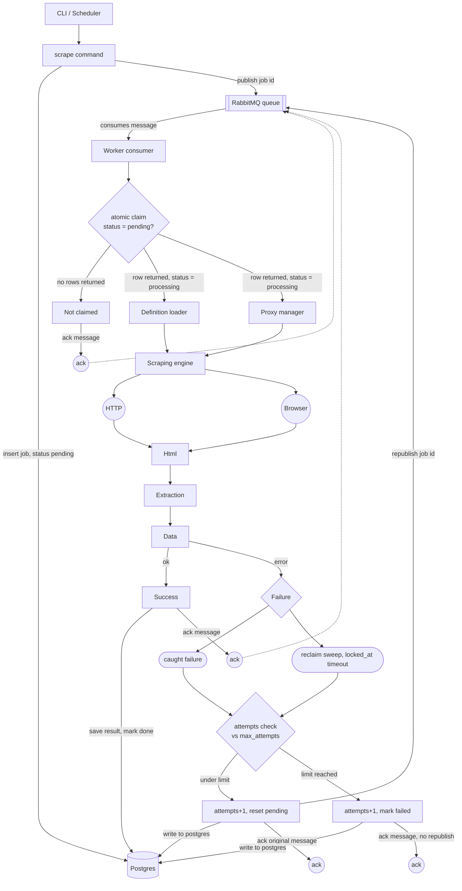

# Architecture

This document is the full reasoning behind the system. `CLAUDE.md` is the
short, enforced rule set for day to day building. This is the "why" behind
those rules, kept here so the reasoning survives even if the person who
designed it isn't the one extending it later.

## What this system does

A CLI takes a url and a source (which site it belongs to). That becomes a
job. A pool of workers pick jobs up, scrape them according to per-site
rules, and save the result. The system is built to survive workers
crashing, jobs failing, and duplicate work, without losing a job or
processing it twice.

## Why a custom pipeline instead of Crawlee

Two infra options were considered. One built entirely custom (this one).
One built on top of Crawlee, which provides request queuing, retries,
concurrency control, proxy rotation, and session handling out of the box.

Crawlee is the faster, more production-proven path, almost nobody in this
industry rebuilds that layer from scratch. It was set aside here
deliberately, in favor of understanding and owning that layer directly,
since building it by hand teaches the actual mechanics rather than
configuring someone else's version of them. This was a considered
tradeoff, not an oversight, expect this pipeline to take real hardening
time before it matches what Crawlee already gives you day one.

## Stack and why

- **TypeScript, strict mode** — job payloads, definitions, and proxy
  config all have shapes that need to stay consistent across the CLI,
  worker, and every definition file. A wrong field name should fail at
  compile time.
- **Commander** — thin CLI parsing, nothing more is needed yet.
- **amqplib + RabbitMQ** — durability is RabbitMQ's default behavior,
  not something you have to configure carefully to get, unlike Redis
  based alternatives (e.g. BullMQ), where getting equivalent durability
  costs some of the speed that's the point of using Redis in the first
  place. Given how much of this design depends on a message never
  silently vanishing, that default mattered more than BullMQ's built in
  scheduling features.
- **raw `pg`, no ORM** — the queries here are few and deliberately
  precise (the atomic claim above all). An ORM tends to fight you when
  you want to write exact SQL, which is the opposite of what this system
  needs.
- **got + cheerio / Playwright** — plain HTTP for static pages, real
  browser for JS-heavy ones, picked per definition, not hardcoded.
- **PM2** — runs a fixed number of identical worker processes.
- **pino** — structured logs, necessary once several workers are logging
  concurrently.
- **pnpm** — strict about not letting code import undeclared
  dependencies, which fits the same "nothing implicit" instinct as the
  rest of this design.

## Core principles

1. **Postgres is the only source of truth.** RabbitMQ never holds or
   implies state, it only dispatches. If the two ever seem to disagree,
   Postgres is right.
2. **Every state transition is one atomic statement.** Never a SELECT
   followed by a separate UPDATE. See "The atomic claim" below for why
   this is the one rule that isn't negotiable.
3. **Ack only after the write succeeds.** A message leaves the queue
   only once its Postgres write has actually committed, never before.
4. **Data and orchestration never mix.** Definitions and the proxy pool
   are data (plus small pure transform functions). Orchestration —
   deciding what to do, calling the database, calling the queue — lives
   only in `worker/processJob.ts`.

## The atomic claim, and why it has to be one statement

The naive version of claiming a job is a SELECT to check status, then an
UPDATE to claim it. That's two separate steps with a gap between them.
If two workers both run the SELECT in that gap, both see `pending`, both
proceed, and the same job gets scraped twice, burning proxy calls and
possibly writing duplicate results.

The fix is doing the check and the claim as the same operation:

```sql
UPDATE jobs
SET status = 'processing', worker_id = $1, locked_at = now()
WHERE id = $2 AND status = 'pending'
RETURNING *;
```

If another worker already claimed it, or it was cancelled, the WHERE
clause matches nothing, zero rows come back, this worker knows
immediately it doesn't own the job. If two workers run this at the exact
same instant, Postgres's row level locking guarantees only one of them
actually gets the update through. No application level locking, no Redis,
no separate lock table, Postgres does this as a side effect of a normal
UPDATE.

## Full job lifecycle

1. **CLI** validates the url, inserts a row into `jobs` with
   `status='pending'`, then publishes `{jobId}` to RabbitMQ. Postgres is
   always written first, never the queue.
2. **Worker** consumes the message, runs the atomic claim above.
   - No row returned → ack the message, do nothing else, move on.
   - Row returned → this worker owns the job exclusively.
3. **Processing** — load the definition for the job's source, check that
   source's proxy/concurrency limit, scrape via HTTP or browser per the
   definition, extract data.
4. **Success** — save the result, mark the job `done`, ack the message.
5. **Failure (caught exception)** — increment `attempts`. Under
   `max_attempts`: reset to `pending` AND publish a fresh message back
   to RabbitMQ (resetting status alone does nothing, since the original
   message is already gone). At the limit: mark `failed` permanently, do
   not republish. Ack either way.
6. **Reclaim sweep** — a periodic check (not cron, just a `setInterval`
   inside an already-running process) looks for jobs stuck at
   `processing` past a timeout based on the slowest real job type. Any
   match goes through the exact same attempts logic as step 5 — this is
   what recovers a job whose worker died mid-task with no chance to run
   its own failure handler.

Both failure sources (a caught exception and the reclaim sweep) converge
on the same attempts check, not two separate retry systems.

## Dead lettering

There is no RabbitMQ dead letter exchange in this design, and that's
intentional, not a gap. A job marked `failed` is never deleted, the row
stays in Postgres permanently with its full url, source, attempts, and
the actual error from its last failure. That's a strictly better dead
letter store than RabbitMQ's native one, which would only hold an opaque
job id with no context.

To retry a failed job (even days later), a dedicated CLI command
(`retry-failed`) queries `jobs` where `status='failed'`, resets matching
rows to `pending`, and republishes a fresh message per job. Whether
`attempts` resets to zero or keeps counting on a manual retry is a real
design choice, not a default — resetting to zero is the current
approach, since a manual retry days later usually means something
external changed.

## Definitions

A definition is a flat file (`definitions/ebay.ts`) by default. It's
promoted to a folder (`definitions/amazon/`) only when it genuinely needs
more than one page type (product vs search), or its selectors plus
transformers exceed roughly 40 lines. Never create folder structure for
a site preemptively — a folder full of near-empty stub files is worse
than a flat file, not more consistent.

Definitions hold data and small pure transform functions only (e.g. a
price string turned into a number). They never call Postgres, RabbitMQ,
or the proxy manager — that orchestration stays in `worker/processJob.ts`
regardless of how a definition is structured internally.

## Proxy handling

`proxy/manager.ts` holds rotation logic and enforces the per-source
concurrency limit. `proxy/pool.ts` holds the actual list of proxies —
this starts as a static array and is expected to move into a Postgres
table (tracking health, ban status, last used time) the moment ban
tracking needs to be visible across all workers simultaneously, the same
reasoning that put job state in Postgres instead of in memory.

## Scaling notes

- **Postgres locks are per row**, held only for the duration of a single
  UPDATE, released on commit. A million job rows is small for Postgres;
  the claim query performs the same regardless of table size because it
  looks up by primary key.
- **Partial indexes** on `status='pending'` and `status='processing'`
  keep the claim and reclaim queries fast without indexing the whole
  table.
- **Worker count is not the real throughput lever for a single source.**
  If a site safely tolerates 5 concurrent requests, running 50 workers
  against it doesn't move the needle, the other 45 sit idle. More
  workers only help once multiple sources are running concurrently, so
  idle capacity from one source's limit can pick up another's jobs.
- **Connection pooling (PgBouncer)** becomes relevant once worker count
  climbs into the dozens, or the moment this moves to managed Postgres
  hosting, which often caps `max_connections` far lower than a
  self-hosted instance. Not needed at the current worker counts.

## Build order

See `CLAUDE.md` for the enforced step-by-step order. It exists so the
riskiest, most foundational piece (the atomic claim, proven correct
under real concurrency) is validated before anything is built on top of
it.

## System diagram



This renders automatically on GitHub and GitLab when this file is viewed
in the repo.
